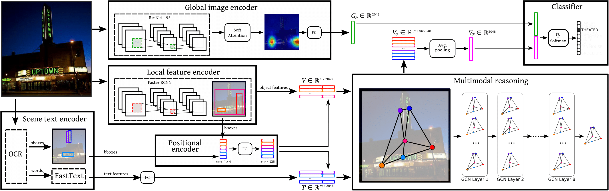

# GCN_classification
Multi-Modal Reasoning Graph for Scene-Text Based Fine-Grained Image Classification and Retrieval

Based on our arxiv pre-print paper:
https://arxiv.org/abs/2009.09809

## Install

Create Conda environment

    $ conda env create -f environment.yml

Activate the environment

    $ conda activate finegrained

## Datasets

Con-Text dataset can be downloaded from:
https://staff.fnwi.uva.nl/s.karaoglu/datasetWeb/Dataset.html

Drink-Bottle dataset:
https://drive.google.com/open?id=1ss9Pxr7rsdCpYX7uKjd-_1R4qCpUYTWT

## Textual Features

TBD

## Train 

export Data_DIR=$PATH_TO_DATASETS$

python train.py (Please refer to the code to decide the args to train the model)

## Reference

If you found this code useful, please cite the following paper:

@article{mafla2020multi,
  title={Multi-Modal Reasoning Graph for Scene-Text Based Fine-Grained Image Classification and Retrieval},
  author={Mafla, Andres and Dey, Sounak and Biten, Ali Furkan and Gomez, Lluis and Karatzas, Dimosthenis},
  journal={arXiv preprint arXiv:2009.09809},
  year={2020}
}

## License

[Apache License 2.0](http://www.apache.org/licenses/LICENSE-2.0)
