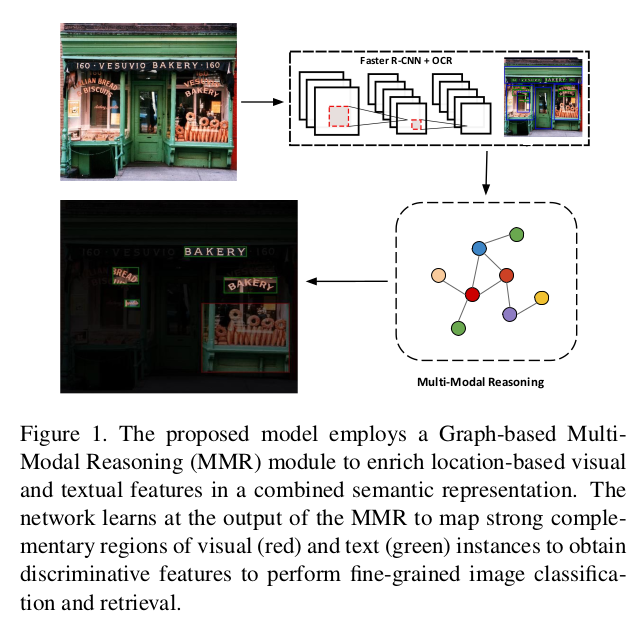

# GCN_classification
Multi-Modal Reasoning Graph for Scene-Text Based Fine-Grained Image Classification and Retrieval

Based on our arxiv pre-print paper:
https://arxiv.org/abs/2009.09809

## Install

Create Conda environment

    $ conda env create -f environment.yml

Activate the environment

    $ conda activate finegrained

## Datasets

Con-Text dataset can be downloaded from:
https://staff.fnwi.uva.nl/s.karaoglu/datasetWeb/Dataset.html

Drink-Bottle dataset:
https://drive.google.com/open?id=1ss9Pxr7rsdCpYX7uKjd-_1R4qCpUYTWT

## Trained Model Weights

Con-Text dataset:
https://drive.google.com/file/d/1axyxyYp6GJBcakjs9bMOdkg4Cq9DtB1b/view?usp=sharing

Drink-Bottle dataset:
https://drive.google.com/file/d/1SDR9NSlOvNJZsCgOaxYFoKkLALJiPKWs/view?usp=sharing

## Textual and Visual Features

Please download the following files and place them in the following dir structure: 
$PATH_TO_DATASETS$/Context/
$PATH_TO_DATASETS$/Drink_Bottle/

**CONTEXT DATASET**

Visual Features Con-Text: 
https://drive.google.com/file/d/1stQGz0uH035uYTgXbjwGAfn-q2GzXSaM/view?usp=sharing
$PATH_TO_DATASETS$/Context/

BBOXES Features Con-Text: 
https://drive.google.com/file/d/107H-sTRGWAAi_2qOSlTAKEG8meuGTQti/view?usp=sharing
$PATH_TO_DATASETS$/Context/

OCR Textual Features Con-Text: 
https://drive.google.com/file/d/1mIhjeas4sVgevk7TSsiAflc--_Iqltpk/view?usp=sharing
$PATH_TO_DATASETS$/Context/google_ocr/text_embeddings/

OCR Textual Con-Text:
https://drive.google.com/file/d/1T5Ui3Xu2g5q9ajpwKmcA9R59KU-sg9EO/view?usp=sharing
$PATH_TO_DATASETS$/Context/google_ocr/bboxes/

**DRINK BOTTLE DATASET**

Visual Features Drink Bottle: 
https://drive.google.com/file/d/1jpAOB1ICVby0YIQQyNfAL7do1RJq5_Xn/view?usp=sharing
$PATH_TO_DATASETS$/Drink_Bottle/

BBOXES Features Drink Bottle:
https://drive.google.com/file/d/15-9tmBfwtC4bi_FB3tgHp5u7xTAzKI--/view?usp=sharing
$PATH_TO_DATASETS$/Drink_Bottle/

OCR Textual Features Drink Bottle:
https://drive.google.com/file/d/1a4WEoRzo6sx4KAX-5TarAaebbc_EJ5AG/view?usp=sharing
$PATH_TO_DATASETS$/Drink_Bottle/google_ocr/text_embeddings/

OCR Textual BBOXES preds:
https://drive.google.com/file/d/1ZQ3ID3IDzwqzx94P2fNXr-agjAhH8YSS/view?usp=sharing
$PATH_TO_DATASETS$/Drink_Bottle/google_ocr/bboxes/

## Train 

    $ export Data_DIR=$PATH_TO_DATASETS$
    
    
    $ python train.py (Please refer to the code to decide the args to train the model)

Example: 

Context dataset

    $python train.py context --batch_size 64 --model fullGCN_bboxes --ocr google_ocr --embedding fasttext --max_textual 15 --max_visual 36 --projection_layer mean --fusion concat --data_path $Data_DIR --split 1

Drink Bottle dataset

    $python train.py bottles --batch_size 64 --model fullGCN_bboxes --ocr google_ocr --embedding fasttext --max_textual 15 --max_visual 36 --projection_layer mean --fusion concat --data_path $Data_DIR --split 1

## Reference

If you found this code useful, please cite the following paper:

@article{mafla2020multi,
  title={Multi-Modal Reasoning Graph for Scene-Text Based Fine-Grained Image Classification and Retrieval},
  author={Mafla, Andres and Dey, Sounak and Biten, Ali Furkan and Gomez, Lluis and Karatzas, Dimosthenis},
  journal={arXiv preprint arXiv:2009.09809},
  year={2020}
}

## License

[Apache License 2.0](http://www.apache.org/licenses/LICENSE-2.0)
